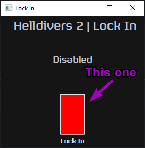

# LockIn
Lock In is a small little tool that locks your cursor to Helldivers 2's window while you're tabbed in.
This is mainly for players using borderless windowed mode who want to prevent accidentally clicking outside the game window while they're playing

# How to use
Simply launch `LockIn.exe`, Click the red button and launch helldivers (Does not need to be in that order)  

## Disclaimer

This is a small, personal project that I wrote for myself and have decided to release to help others with the same problem. 
**There will most likely be bugs and issues.**  
While this program shouldn't cause any issues at all (It doesn't even do much) I cannot guarentee this program will not cause any issues. 
Additionally I have not signed this executable so many antivirus will probably flag it up. 

## Contribution
This code is pretty messy. I was not aiming for professional levels while writing this.
If you feel like contributing I'd be more than happy to have you help.
